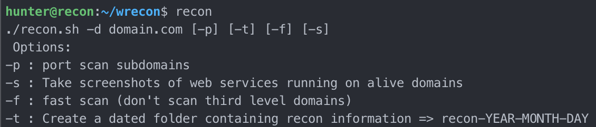
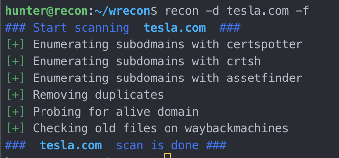
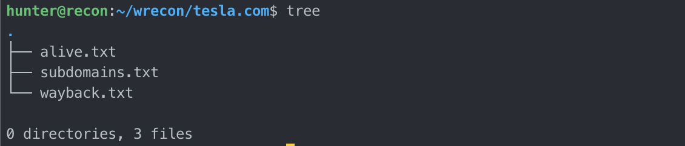

# WRecon

---------

Recon is a Bash script that you can use to automate recon on web target.

# Features

---------

## Main 

* Enumerate subdomains using :
  * `crtsh, certspotter, assetfinder`
* Probe for alive web host (on port 80 and 443)
* Check old file on `https://https://archive.org/web/`(wayback machine)

## Optionnal

* Create a dated folder containing recon informations
* Taking screenshots of alive hosts
* Scan all ports of subdomains

# Usage

-------



# Output

-------





*NOTE*: This is the output of a fast scan `-f`, if you use more options other files will be created

# Installlation

-------

You have two options : 

### Create a command

```bash
git clone https://github.com/vnch31/wrecon.git
cd wrecon/
sudo ln -s recon /usr/bin/recon
```

### Use it as a Bash script

```bash
git clone https://github.com/vnch31/wrecon.git
cd wrecon/
mv recon recon.sh
chmod +x recon.sh
```


